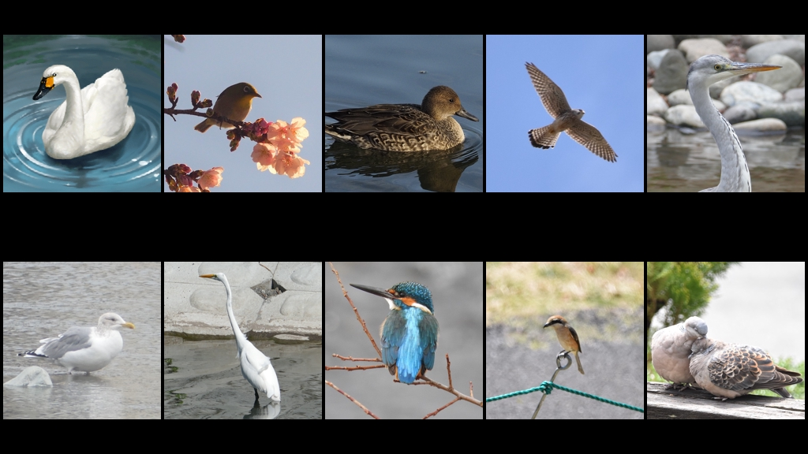
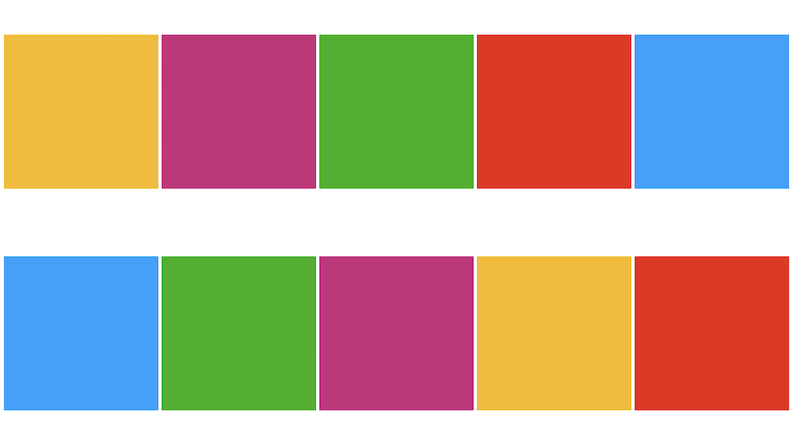

# image-combinator

複数の画像を連結して 1 枚の画像を生成するプログラム  
Twitter と YouTube の画面に最適化している  
大量の画像があるとき編集作業を自動化する




たとえば Twitter の投稿に用いる場合  
16 : 9 のアスペクト比で 2 種類の画像を生成できる

- 10 枚の画像から 1 枚の画像を生成
- 144 枚の画像から 1 枚の画像を生成




- [前提](#前提)
- [実行](#実行)
- [コマンドオプション](#コマンドオプション)
- [機能](#機能)
- [追加予定の機能](#追加予定の機能)
- [出力画像のユースケース](#出力画像のユースケース)
- [出力画像パターン](#出力画像パターン)
- [入力画像の過不足](#入力画像の過不足)

<br>

## 前提

- 入力画像１枚は正方形である
- 入力画像の拡張子は .jpg / .png / .gif である
- 入力画像は assets/input に配置する
- 出力画像は assets/output に生成される

<br>

## 実行

対話入力

```zsh
% go run cmd/image-combinator/main.go

Enter the platform where you will submit images. [twitter / youtube]
twitter # ⏎

Enter the usecase of output images. [post / header]
post # ⏎

Enter the quantity of materials per output image. [10 / 144]
10 # ⏎

successful output => assets/output/output-1.jpg (.png / .gif)
```

フラグ指定

```zsh
% go run cmd/image-combinator/main.go -p youtube -u thumbnail -d 144
```

## コマンドオプション

| オプション | オプションの意味                             | オプションのパラメータ                                      |
| ---------- | -------------------------------------------- | ----------------------------------------------------------- |
| -d         | density を指定する<br>アスペクト比に依存する | 3:1 : 3 または 75 枚で構成<br>16:9 : 10 または 144 枚で構成 |
| -p         | platform を指定する                          | twitter, youtube                                            |
| -u         | usecase を指定する<br>platform ごとに異なる  | twitter : post, header<br>youtube : screen, thumbnail       |

<br>

## 機能

- CLI からのオプション入力
  - フラグ指定
  - 対話的インターフェース
    - フラグが不正・未指定のとき不足分を補う
- 入力画像のリサイズ
- 入力画像枚数の過不足対応
- 出力画像サイズ比の可変化
- 出力画像のファイル形式変更

<br>

## 追加予定の機能

- CLI からのオプション入力の拡張
  - 出力画像のファイル名を指定
  - 出力画像のファイル形式を指定

<br>

## 出力画像のユースケース

- Twitter
  - ヘッダー 1500px : 500px = 3 : 1
  - １枚投稿
    - sm & pc 1024px : 576px = 16 : 9
- YouTube
  - 再生画面 1920px : 1080px = 16 : 9
  - サムネイル 1280px : 720px = 16 : 9

<br>

## 出力画像パターン

- 3 : 1
  - 画像素材 3 \* 1 枚，padding なし
  - 画像素材 15 \* 5 枚，padding なし
- 16 : 9
  - 画像素材 5 \* 2 枚，padding あり
  - 画像素材 16 \* 9 枚，padding なし

<br>

## 入力画像の過不足

- 不足 : デフォルト画像で補填する
- 超過 : 出力画像枚数を増加させる
