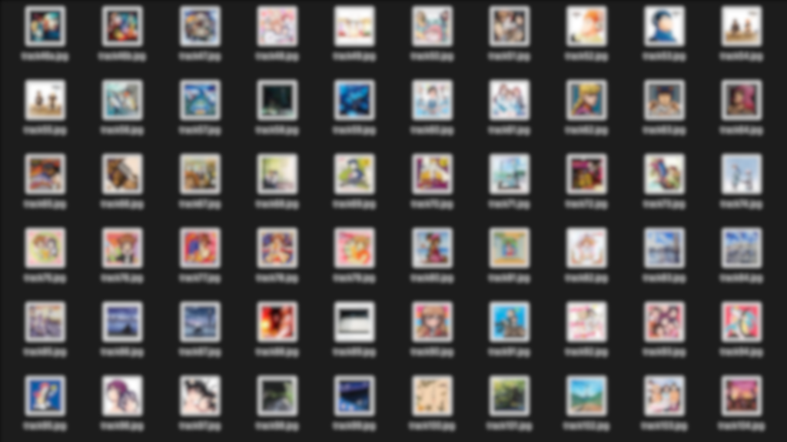
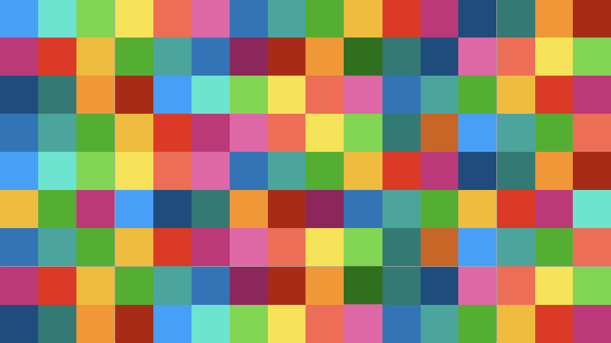

# image-combinator

複数の画像を連結して 1 枚の画像を生成するプログラム  
Twitter と YouTube の画面に最適化している  
大量の画像があるとき編集作業を自動化する



たとえば Twitter の投稿に用いる場合  
16 : 9 のアスペクト比で 2 種類の画像を生成できる

- 10 枚の画像から 1 枚の画像を生成
- 144 枚の画像から 1 枚の画像を生成




<br>

## 前提

- 入力画像１枚は正方形である
- 入力画像は jpeg 形式である
- 入力画像は assets/input に配置する
- 出力画像は assets/output に生成される
- 入出力画像の整形は今後対応

<br>

## 実行

対話入力

```zsh
% go run cmd/image-combinator/main.go

Enter the platform where you will submit images. [twitter / youtube]
twitter # ⏎

Enter the usecase of output images. [post / header]
post # ⏎
```

フラグ指定

```zsh
% go run cmd/image-combinator/main.go -p youtube -u thumbnail
```

## コマンドオプション

| オプション | オプションの意味                            | オプションのパラメータ                                |
| ---------- | ------------------------------------------- | ----------------------------------------------------- |
| -p         | platform を指定する                         | twitter, youtube                                      |
| -u         | usecase を指定する<br>platform ごとに異なる | twitter : post, header<br>youtube : screen, thumbnail |

<br>

## 機能

- CLI からのオプション入力
  - フラグ指定
  - 対話的インターフェース
- 入力画像の整形（予定）
- 入力画像枚数の過不足対応（予定）
- 出力画像サイズ比の可変化（予定）
- 出力画像のファイル形式変更（予定）

<br>

## 出力画像のユースケース

- Twitter
  - ヘッダー 1500px : 500px = 3 : 1
  - １枚投稿
    - sm & pc 1024px : 576px = 16 : 9
- YouTube
  - 再生画面 1920px : 1080px = 16 : 9
  - サムネイル 1280px : 720px = 16 : 9

<br>

## 出力画像パターン

- 3 : 1
  - 画像素材 3 \* 1 枚，padding なし
  - 画像素材 15 \* 5 枚，padding なし
- 16 : 9
  - 画像素材 5 \* 2 枚，padding あり
  - 画像素材 16 \* 9 枚，padding なし

<br>

## 入力画像の過不足

- 不足 : デフォルト画像で補填する
- 超過 : 出力画像枚数を増加させる
